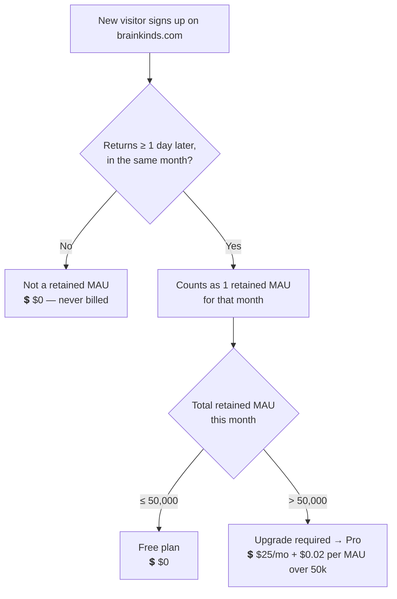
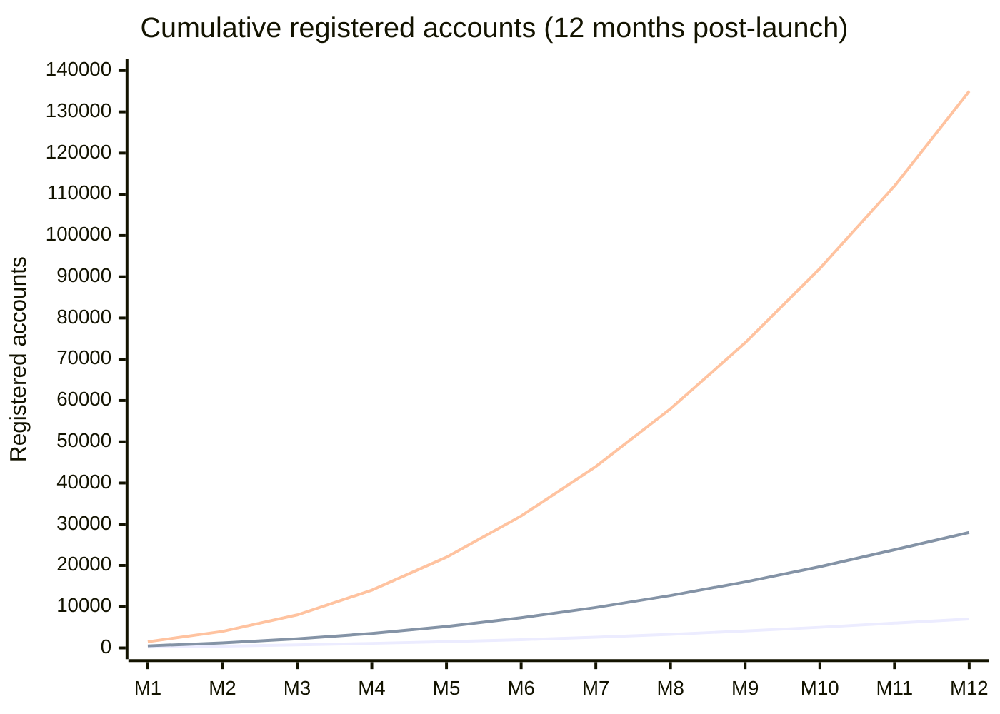
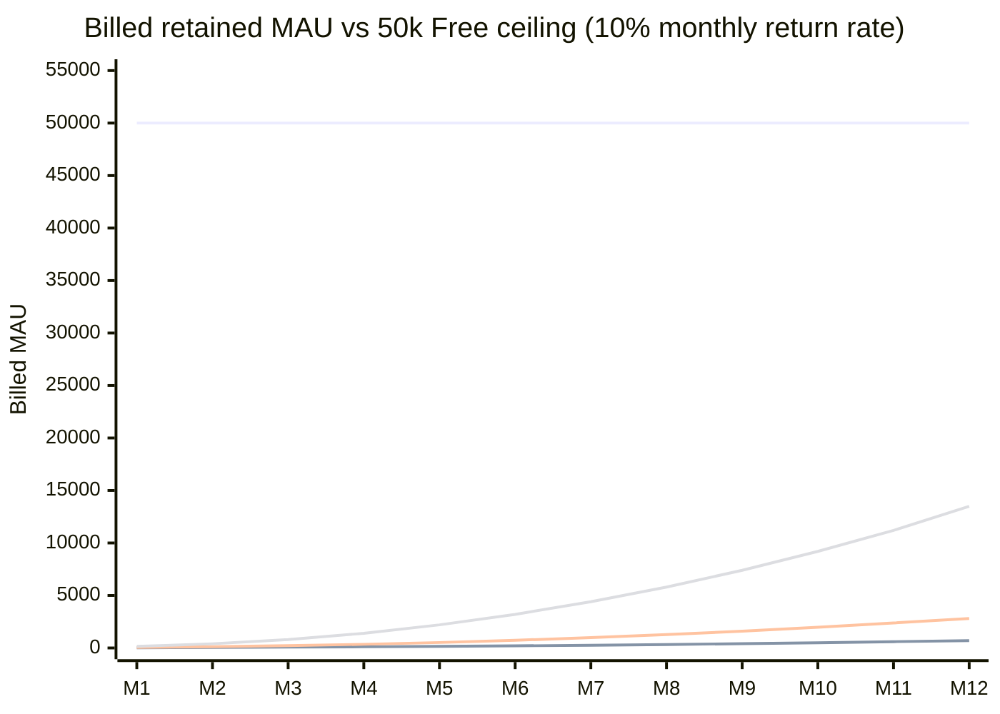
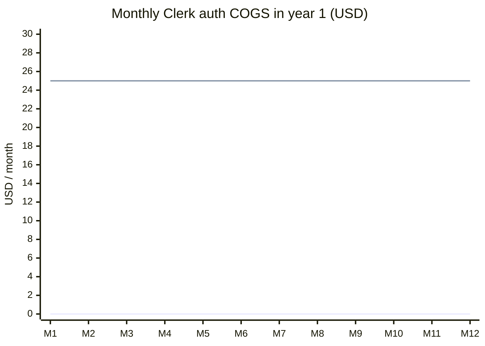
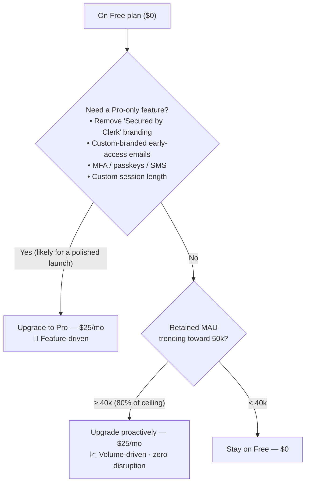
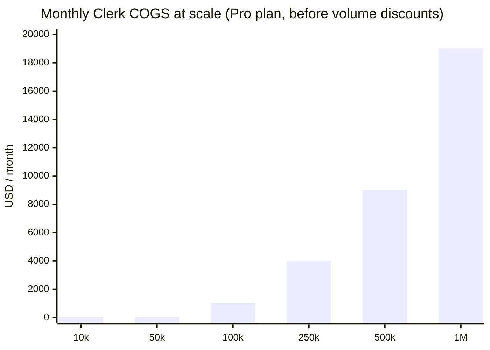

# Clerk Authentication — Cost Projection & COGS Analysis

> Scope: **authentication only** (the Clerk service). This covers our public
> **Website Launch** milestone — `brainkinds.com` live for informational
> purposes, with early sign-ups collecting emails and creating Clerk accounts
> that are **not yet activated** for portal access.
>
> Pricing verified against `clerk.com/pricing` (May 2026). Clerk recently
> **raised the free tier from 10,000 → 50,000 MAU**. See [Sources](#sources).

---

## TL;DR

1. **We can launch on the Free plan and pay $0 — with enormous headroom.** The
   free tier covers **50,000 monthly active users (MAU)**.
2. **Account count is *not* what we get billed on.** Clerk bills on *retained*
   MAU — users who **return at least one day after signing up**. A waitlist
   sign-up who never logs back in (our launch case) is **never billed**.
3. **Realistically, our billed MAU stays near zero through launch**, because the
   portal isn't active — people sign up once and don't return. We could collect
   *hundreds of thousands* of emails/accounts and still pay $0 on volume.
4. **The likely reason to pay isn't volume — it's a feature.** Removing the
   "Secured by Clerk" branding, sending custom-branded early-access emails, or
   enabling MFA/passkeys all require **Pro at a flat $25/mo**. That's the real
   decision for a polished public launch.
5. **No-disruption rule:** upgrade to Pro proactively the moment we either (a)
   want a Pro-only feature, or (b) cross **~40,000 retained MAU (80% of the free
   ceiling)** — whichever comes first. Upgrading is seamless (no migration, no
   downtime), so there is no disruption risk as long as we don't blow past 50k
   on Free.

---

## 1. How Clerk pricing works

| Plan | Base price | Included MAU | Overage | Notable limits / unlocks |
|------|-----------|--------------|---------|--------------------------|
| **Free (Hobby)** | **$0** | **50,000** | n/a — must upgrade once exceeded | Clerk branding can't be removed · session fixed at 7 days · no SMS codes · no passkeys · no MFA · no enterprise SSO |
| **Pro** | **$25/mo** ($20/mo annual) | **50,000** | **$0.02 / MAU** beyond 50k (volume discounts at higher tiers) | Remove branding · passkeys · MFA · custom email templates · custom password rules · custom session duration · 1 enterprise SSO included (+$75/mo each additional) |
| **Enterprise** | Custom | Custom | Custom | Compliance, SLAs, volume pricing |

**What is an MAU?** Clerk counts a **"monthly retained user"** — *a user who
visits your app in a given month **at least one day after signing up**.* There
is also a **"First Day Free"** policy: the first 24 hours after sign-up never
count toward billing.

---

## 2. Why this matters for *our* launch

Our launch is **informational + waitlist**:

- People visit `brainkinds.com`, see what Brainkinds is.
- Interested users **sign up** → we collect their email and create a Clerk account.
- Those accounts are **not activated** — there's no portal to log into yet.

So in billing terms:

- **Sign-up day = First Day Free** → not counted.
- **No portal = no reason to return** → almost nobody becomes a "retained MAU".
- Even accounts we create **programmatically** for the waitlist don't bill until
  those users actually start signing in (i.e., when the portal opens in a later
  milestone).

**Conclusion:** during the Website Launch phase, **total accounts ≈ unlimited
for $0**; billed MAU is driven only by the small fraction of people who revisit.

---

## 3. Growth scenarios & assumptions

We model **12 months post-launch** with three scenarios. The only assumption
that touches cost is the **monthly return rate** — the share of registered
accounts that come back at least a day later in a given month (and so become
billable). For an info site with no active portal this is low; we use a
deliberately **generous 10%** for the billed-MAU lines below.

| Scenario | Month-12 registered accounts | Billed MAU @ 10% return | Free headroom used |
|----------|------------------------------|--------------------------|--------------------|
| Conservative | ~7,000 | ~700 | 1.4% |
| Base | ~28,000 | ~2,800 | 5.6% |
| Aggressive | ~135,000 | ~13,500 | 27% |

> Even the **Aggressive** scenario uses only ~27% of the free MAU ceiling. To
> actually exceed 50,000 *billed* MAU at a 10% return rate, we'd need
> **~500,000 registered accounts**.

### Chart A — Cumulative registered accounts

_Series, bottom → top: Conservative · Base · Aggressive._

### Chart B — Billed (retained) MAU vs the Free ceiling

_Top flat line = 50,000 free ceiling. Lower lines, bottom → top: Conservative ·
Base · Aggressive billed MAU. The point: every scenario hugs the floor._

### Chart C — Year-1 Clerk COGS: Free vs Pro

Because every scenario stays under 50k billed MAU, there is **no overage** in
year 1. COGS is therefore **either $0 (Free) or a flat $25/mo (Pro — only if we
want Pro features for the launch)**.

_Lower flat line = Free ($0). Upper flat line = Pro ($25/mo)._

| Path | Monthly | Annual | When it applies |
|------|---------|--------|-----------------|
| Stay on Free | **$0** | **$0** | Launch is fine on volume alone; branding stays |
| Pro (feature-driven) | **$25** | **$300** | If we want branding removal / custom emails / MFA at launch |

---

## 4. When do we actually start paying?

There are **two independent triggers**. For us, the **feature trigger** is the
one that bites first — not volume.

**Answer to "how many accounts/usage before we must pay (without disruption)?"**

- **Volume answer:** ~**50,000 *retained* MAU in a single month** is the hard
  ceiling on Free. At a realistic ~10% return rate that's ~**500,000 registered
  accounts** — far beyond the launch phase. Upgrade at **40,000 retained MAU**
  (80%) to stay ahead of it with zero disruption.
- **Practical answer:** we'll most likely choose Pro **for a feature** (brand
  polish / custom emails) long before volume is ever a concern. At **$25/mo flat
  under 50k MAU**, that decision is essentially free.

---

## 5. COGS at scale (for when the portal opens & users return monthly)

Once the portal is live and users log in regularly, retained MAU climbs and we
move onto Pro overage. Per-MAU cost beyond the included 50k is **$0.02/MAU**.

| Retained MAU | Plan | Monthly COGS | Effective $/MAU |
|--------------|------|--------------|-----------------|
| 10,000 | Free (or Pro for features) | $0 (or $25) | ~$0 |
| 50,000 | Free / Pro | $0 / $25 | ~$0.0005 |
| 100,000 | Pro | $25 + $0.02×50,000 = **$1,025** | $0.0103 |
| 250,000 | Pro | $25 + $0.02×200,000 = **$4,025** | $0.0161 |
| 500,000 | Pro | $25 + $0.02×450,000 = **$9,025** | $0.0181 |
| 1,000,000 | Pro | $25 + $0.02×950,000 = **$19,025** | $0.0190 |

> Clerk applies **volume discounts** above the first overage tier, so figures at
> 250k+ MAU are conservative upper bounds. At true enterprise scale we'd move to
> a custom Enterprise contract.

---

## 6. Recommendation

- **Launch on Free.** On volume, we have ~50,000 MAU of headroom and will use a
  tiny fraction of it. Cost = **$0**.
- **Decide Pro on features, not numbers.** If the public launch needs the
  "Secured by Clerk" badge gone or custom-branded waitlist emails, budget the
  flat **$25/mo ($300/yr)** — negligible against the brand benefit.
- **Set a guardrail alert at 40,000 retained MAU** (80% of the free ceiling) so
  we upgrade proactively and never risk a forced, last-minute upgrade.
- **Revisit when the portal activates** (next milestone): that's when retained
  MAU — and therefore real COGS — begins to grow, following Section 5.

---

## Sources

- [Clerk Pricing](https://clerk.com/pricing) — live plan tiers, MAU definition, overage rate (fetched May 2026)
- [Clerk blog — Updated Pricing: free MAU & Pro Plan](https://clerk.com/blog/new-pricing-plans)
- [SaaSPrices — Clerk Pricing Update: 50k Free MAU](https://saasprices.net/blog/clerk-free-plan-changes)
- [WorkOS — How Clerk pricing works](https://workos.com/blog/clerk-pricing)
