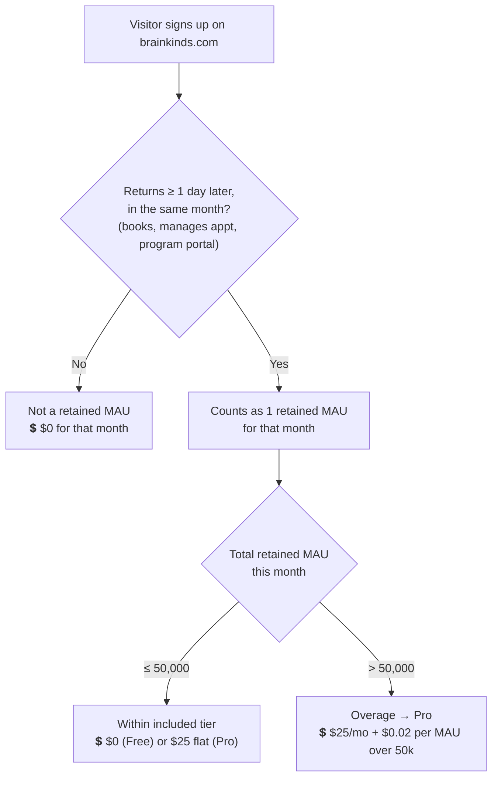
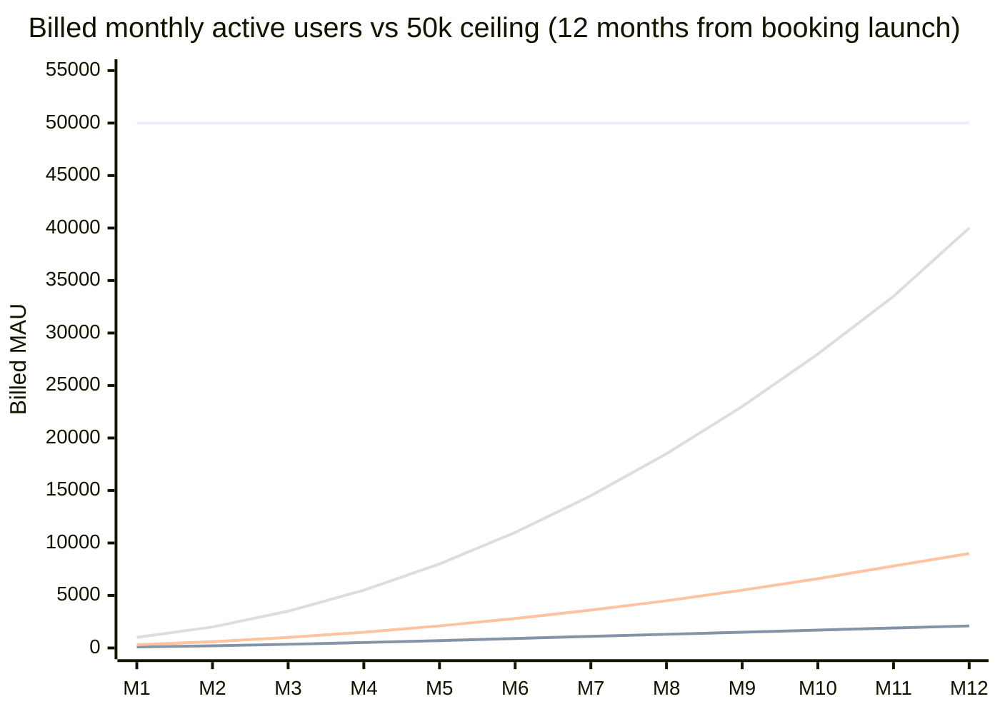
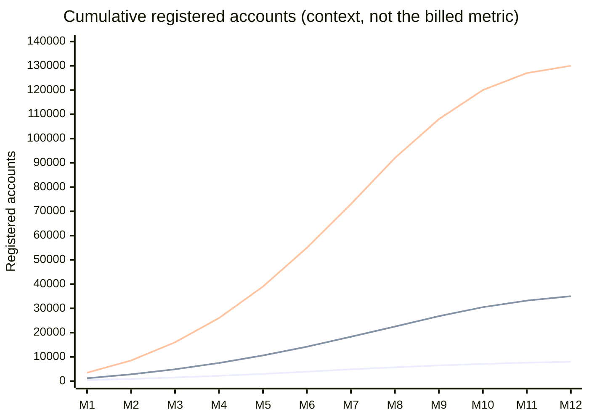
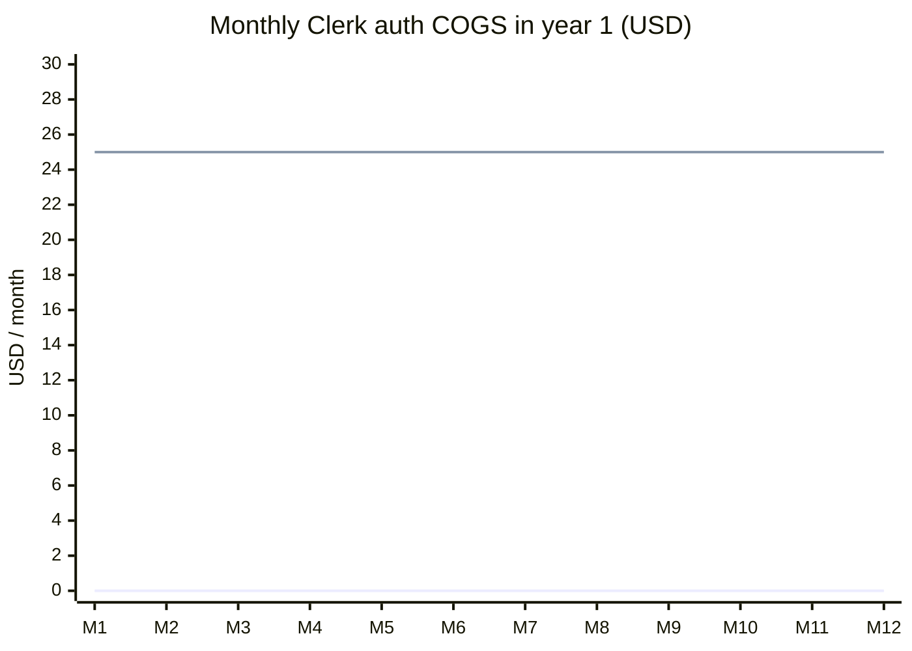
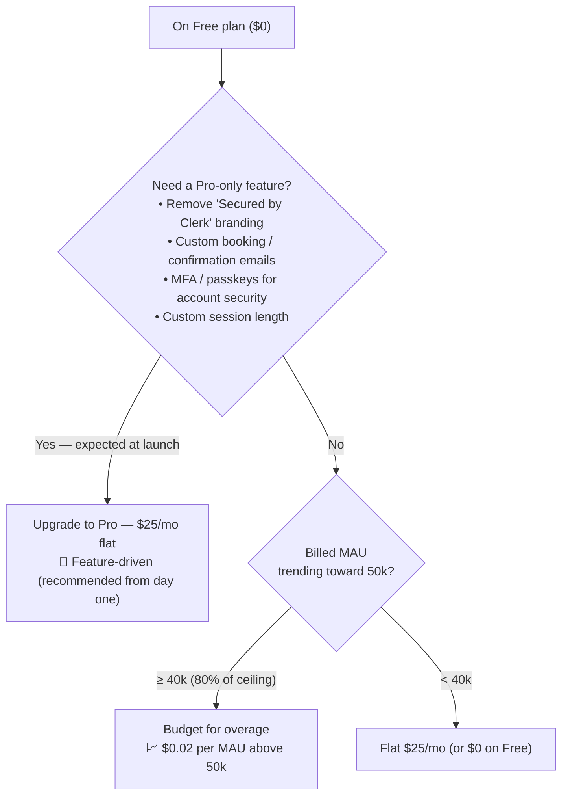
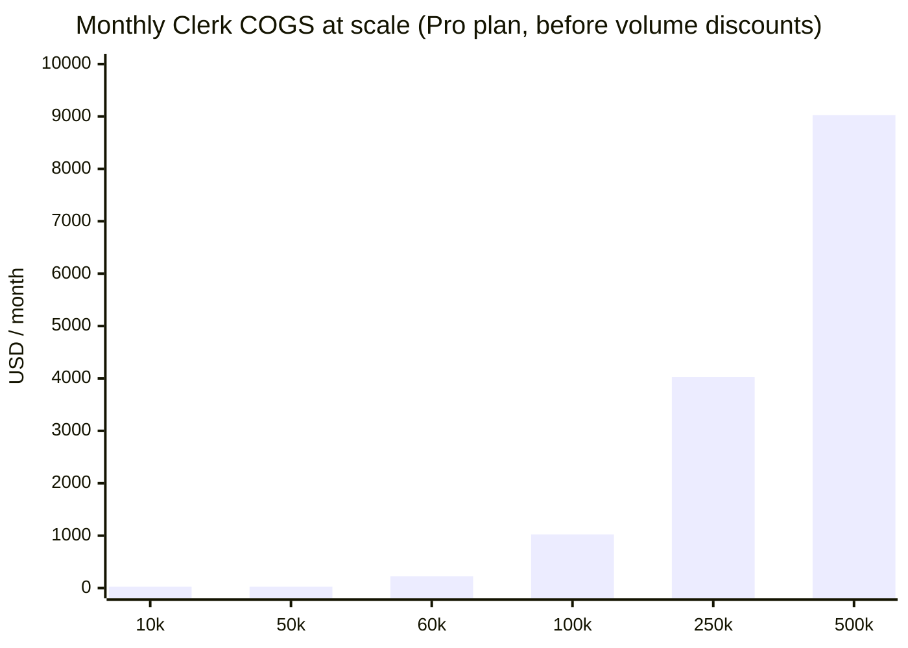

# Clerk Authentication — Cost Projection & COGS Analysis

> Scope: **authentication only** (the Clerk service). This covers the
> **Website Launch** milestone — `brainkinds.com` live as a **full launch**:
> visitors create real accounts and **book BrainKinds services** (the flagship
> **BrainKinds Method** eight-week program, plus all other offerings).
> Bookings open **after mid-September 2026**.
>
> Pricing verified against `clerk.com/pricing` (May 2026). Clerk recently
> **raised the free tier from 10,000 → 50,000 MAU**. See [Sources](#sources).

---

## TL;DR

1. **Free covers 50,000 monthly active users (MAU).** That's a lot of runway —
   but unlike a waitlist, this is a real product, so users **do** return and
   **do** count toward that number.
2. **Booking + the eight-week program make users genuinely active.** Someone in
   the BrainKinds Method logs in across ~8 weeks; booking customers return to
   manage appointments. These are _retained_ MAU — the metric Clerk bills on.
3. **We'll almost certainly want Pro from launch — for features, not volume.**
   A real booking product wants the "Secured by Clerk" branding removed,
   custom-branded booking/confirmation emails, MFA for account security, and
   custom session length. All of those require **Pro at a flat $25/mo**.
4. **Volume overage is a year-2 concern in the strong case.** Even an aggressive
   ramp stays under the 50k included MAU through all of year 1, so COGS is a
   **flat $25/mo (~$300/yr)** on Pro — overage ($0.02/MAU) only begins above 50k.
5. **No-disruption rule:** be on Pro from launch (feature-driven), and watch
   billed MAU — upgrade headroom is automatic, but plan budget for overage once
   monthly actives approach **40,000 (80% of the included 50k)**.

---

## 1. How Clerk pricing works

| Plan             | Base price                 | Included MAU | Overage                                                       | Notable limits / unlocks                                                                                                                                          |
| ---------------- | -------------------------- | ------------ | ------------------------------------------------------------- | ----------------------------------------------------------------------------------------------------------------------------------------------------------------- |
| **Free (Hobby)** | **$0**                     | **50,000**   | n/a — must upgrade once exceeded                              | Clerk branding can't be removed · session fixed at 7 days · no SMS codes · no passkeys · no MFA · no enterprise SSO                                               |
| **Pro**          | **$25/mo** ($20/mo annual) | **50,000**   | **$0.02 / MAU** beyond 50k (volume discounts at higher tiers) | Remove branding · passkeys · MFA · custom email templates · custom password rules · custom session duration · 1 enterprise SSO included (+$75/mo each additional) |
| **Enterprise**   | Custom                     | Custom       | Custom                                                        | Compliance, SLAs, volume pricing                                                                                                                                  |

**What is an MAU?** Clerk counts a **"monthly retained user"** — _a user who
visits your app in a given month **at least one day after signing up**._ There
is also a **"First Day Free"** policy: the first 24 hours after sign-up never
count toward billing.

---

## 2. Why this matters for _our_ launch

This is a **full launch**, not a waitlist:

- Visitors create **real, usable accounts**.
- They **book** the BrainKinds Method (eight-week program) and other services.
- Bookings go live **after mid-September 2026**.

So engagement — and therefore billed MAU — is **real**:

- **Program participants** log in repeatedly across ~8 weeks → monthly-active
  for roughly two billing months each.
- **Booking customers** return to schedule/manage appointments → monthly-active
  in any month they engage.
- Sign-up day is still **First Day Free**, but unlike a waitlist, these users
  _do_ come back — so they **count**.

**Conclusion:** billed MAU now tracks our **active customer base**, not just
total sign-ups. The 50k free ceiling is generous, but it's a real ceiling we'll
grow into as the business scales.

---

## 3. Growth scenarios & assumptions

Twelve months measured from **booking go-live (~Oct 2026)**. The billable metric
is **monthly active (retained) users** — modeled directly below. Cumulative
registered accounts are shown for context (always higher than MAU, since not
every registrant is active every month).

| Scenario     | Month-12 billed MAU | Month-12 registered accounts | Free ceiling used |
| ------------ | ------------------- | ---------------------------- | ----------------- |
| Conservative | ~2,100              | ~8,000                       | 4%                |
| Base         | ~9,000              | ~35,000                      | 18%               |
| Aggressive   | ~40,000             | ~130,000                     | 80%               |

> Only the **Aggressive** case approaches the ceiling, reaching ~80% by month 12
> and crossing **50k MAU in early year 2** — that's when volume overage begins.

### Chart A — Billed (active) MAU vs the 50k Free ceiling

_Top flat line = 50,000 ceiling. Lower lines, bottom → top: Conservative · Base
· Aggressive billed MAU._

### Chart B — Cumulative registered accounts (context)

_Series, bottom → top: Conservative · Base · Aggressive._

### Chart C — Year-1 Clerk COGS

Every scenario stays under the 50k included MAU through year 1, so there is **no
overage**. COGS is **flat**: $0 if we somehow stayed on Free, or **$25/mo on Pro**
(recommended — see §4).

_Lower flat line = Free ($0). Upper flat line = Pro ($25/mo)._

| Path              | Monthly | Annual   | When it applies                                                                       |
| ----------------- | ------- | -------- | ------------------------------------------------------------------------------------- |
| Free              | **$0**  | **$0**   | Volume-wise fine in year 1, but keeps Clerk branding & blocks MFA/custom emails       |
| Pro (recommended) | **$25** | **$300** | Unlocks branding removal, custom booking emails, MFA — appropriate for a real product |

---

## 4. When do we actually start paying?

Two independent triggers. For a real booking product, the **feature trigger**
fires at launch; the **volume trigger** is a year-2 consideration.

**Answer to "how many accounts/usage before we must pay (without disruption)?"**

- **Feature answer (binds first):** essentially at launch. A booking product
  with personal data should ship with branding removed, branded transactional
  emails, and MFA — all Pro. Budget **$25/mo flat** from day one.
- **Volume answer:** the hard ceiling is **50,000 _active_ MAU in a month**.
  Conservative/Base never approach it in year 1; Aggressive reaches ~80% by
  month 12 and crosses 50k in **early year 2**, after which overage is
  **$0.02/MAU**. Upgrading is seamless on Pro (no migration), so there's no
  disruption — just plan the overage budget once monthly actives near 40k.

---

## 5. COGS at scale (year 2+ as the active base grows)

Per-MAU cost beyond the included 50k is **$0.02/MAU**.

| Billed MAU | Monthly COGS                     | Effective $/MAU |
| ---------- | -------------------------------- | --------------- |
| 10,000     | $25 (or $0 on Free)              | ~$0.0025        |
| 50,000     | $25                              | $0.0005         |
| 60,000     | $25 + $0.02×10,000 = **$225**    | $0.00375        |
| 100,000    | $25 + $0.02×50,000 = **$1,025**  | $0.0103         |
| 250,000    | $25 + $0.02×200,000 = **$4,025** | $0.0161         |
| 500,000    | $25 + $0.02×450,000 = **$9,025** | $0.0181         |

> Clerk applies **volume discounts** above the first overage tier, so 250k+
> figures are conservative upper bounds. At enterprise scale we'd move to a
> custom Enterprise contract.

---

## 6. Recommendation

- **Launch on Pro ($25/mo).** This is a real product handling accounts, bookings,
  and personal data — Pro is the right baseline for branding removal, branded
  booking emails, and MFA. At ~$300/yr it's negligible against the brand and
  trust benefit.
- **Year-1 COGS is effectively the $25/mo flat fee.** No overage in any modeled
  scenario, because billed MAU stays under the included 50k.
- **Watch billed MAU as bookings scale.** Set an internal alert at **40,000
  active MAU** so the overage line item ($0.02/MAU) is budgeted before it hits.
- **Revisit at enterprise scale.** Above ~250k MAU, evaluate Clerk's volume
  discounts / Enterprise pricing.

---

## Sources

- [Clerk Pricing](https://clerk.com/pricing) — live plan tiers, MAU definition, overage rate (fetched May 2026)
- [Clerk blog — Updated Pricing: free MAU & Pro Plan](https://clerk.com/blog/new-pricing-plans)
- [SaaSPrices — Clerk Pricing Update: 50k Free MAU](https://saasprices.net/blog/clerk-free-plan-changes)
- [WorkOS — How Clerk pricing works](https://workos.com/blog/clerk-pricing)
